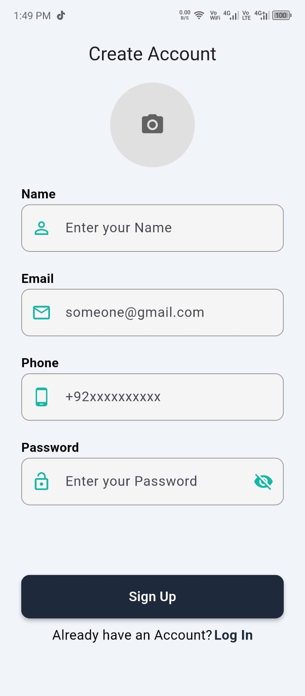
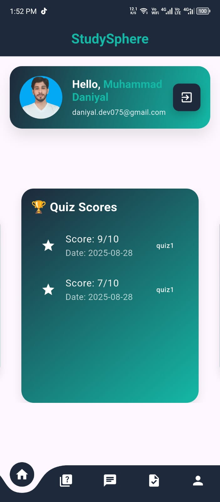
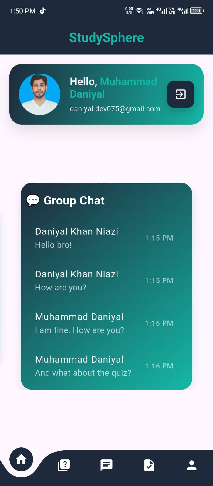
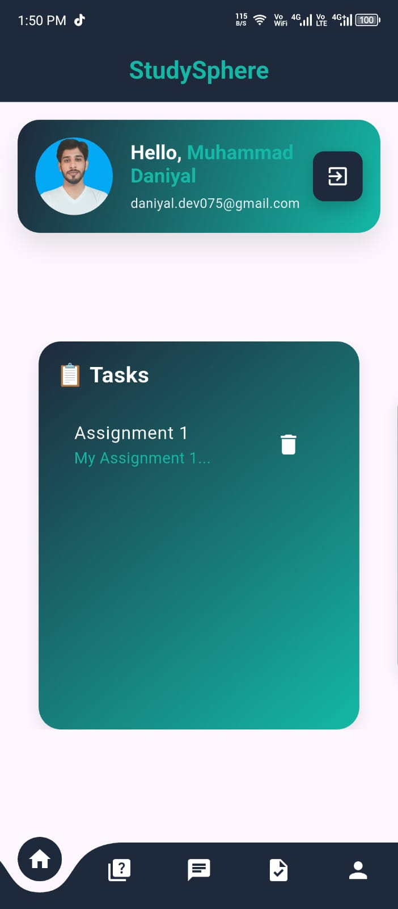
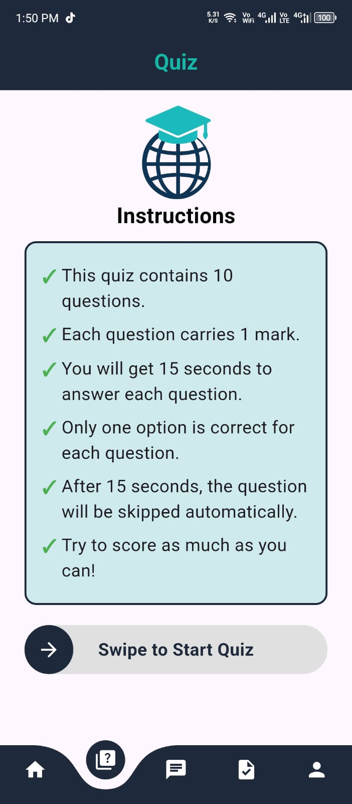
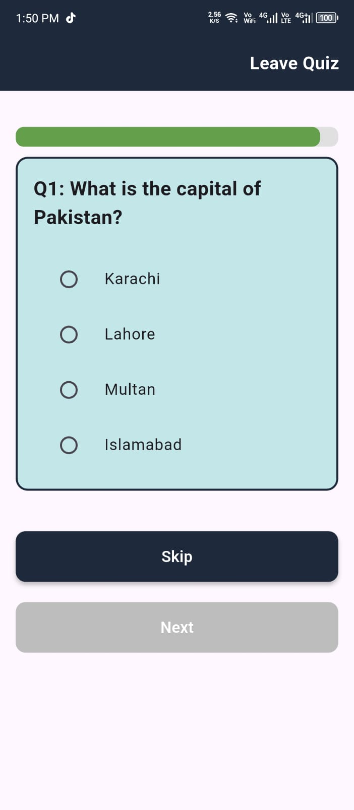
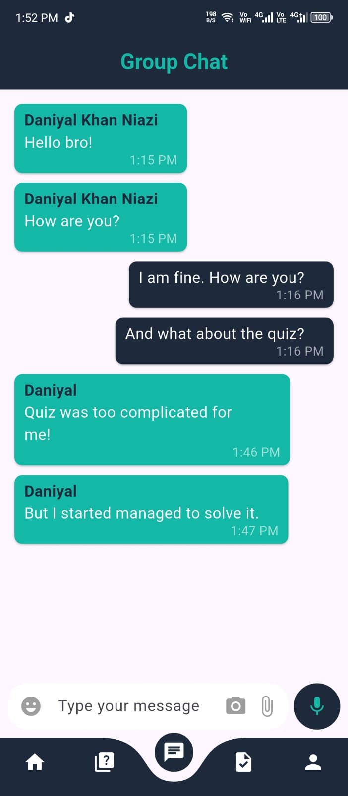
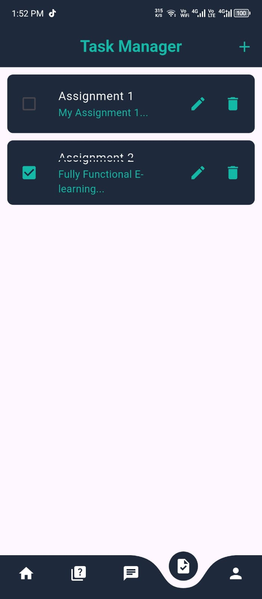

# 📚 StudySphere – E-Learning & Task Management App  

StudySphere is an **e-learning mobile app** built with Flutter, designed to help students and learners manage their studies efficiently.  
It provides features like **quizzes, task management, group chats, profile management**, and more – all in a single app.  

---

## ✨ Features  

- 🔑 **Authentication**  
  - Secure login & signup using **Firebase Authentication** (email & password).  

- 📝 **Quiz Module**  
  - Take quizzes with a timer.  
  - View **scores & history** stored in **Firestore**.  

- ✅ **Task Manager**  
  - Create, delete, update tasks.  
  - Add details & mark tasks as complete.  

- 👤 **Profile View**  
  - Display user info.  
  - Update user details and profile picture in **Firestore**.  

- 💬 **Group Chat**  
  - Real-time **group chat feature** to collaborate with peers.  

- 🏠 **Home View**  
  - Centralized view displaying user info, tasks list, chat lists, and quiz scores.  

---

## 🛠 Tech Stack  

- **Flutter & Dart** – Cross-platform app development  
- **Provider (MVVM Architecture)** – State management  
- **Firebase**  
  - Authentication  
  - Firestore Database  
  - Storage  

- **UI Enhancements**  
  - Used various packages for **animations, responsiveness, and attractive UI design**.  

---

## 📸 Screenshots  

| | | |
|---|---|---|
|  |  |  |
|  |  |  |
|  |  |  |
|  |  |  |
  

---

## 🎥 Demo Video  

👉 [Watch Demo](your-demo-video-link-here)  

---

## 🚀 Getting Started  

### Prerequisites  
- Flutter SDK  
- Firebase project setup  

### Installation  
```bash
# Clone the repository
git clone https://github.com/your-username/studysphere.git  

# Navigate into the project directory
cd studysphere  

# Get dependencies
flutter pub get  

# Run the app
flutter run
